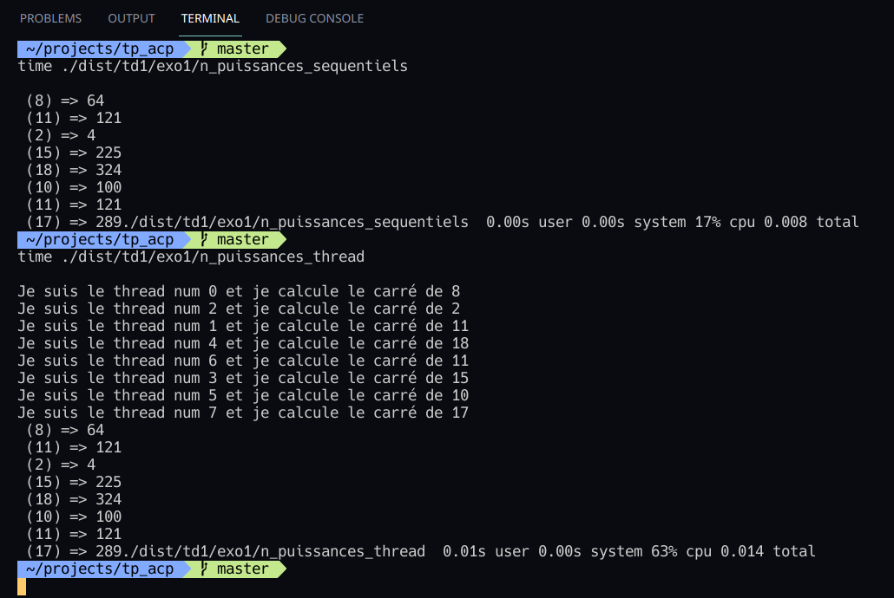
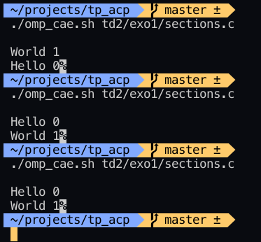
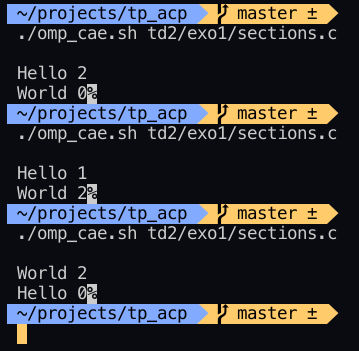
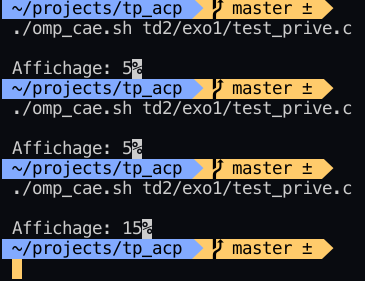
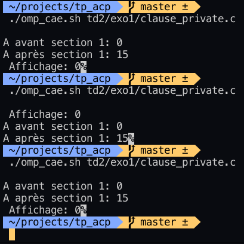

# TP Architecture et Calcul Parallèle

## Notes et remarques

### cae.sh

C'est tous simplement un script en bash très court qui sert à compiler avec *-lpthread* et éxécuter (Compile And Execute) un fichier de scripts et de générer un executable dans le dossier dist
#### utilisation
`./cae.sh [chemin du script à partir de ./scripts/]`

### omp_cae.sh
Même tâche que cae.sh sauf que ce dernier compile avec *-fopenmp* avant d'exécuter

## Exercices

### TP1
#### Exo1

- Les messages du thread ne s'ont pas affichés car le thread principal a terminé suffisamment rapidement avant que le thread crée puisse afficher les messages nécessaires
- Le rôle de la fonction thread_join est d'attendre la fin d'exécution du thread crée poour continuer ensuite l'execution
- replacer l'appel de la fonction pthread_exit par un simple appel d' exit() stopperait tout le programme (processus) dés que le thread crée termine, et donc avant l'affichage du dernier message du thread parent
- Le temps d'exécution du programme de calcul séquentiel est plus rapide car le coût de la création de nouveau threads dépasse l'avantage obtenu par ces derniers vu que le "job" est très simple
- 


#### Exo2

- 

### TP2 (Open MP)

#### Exercice 1

 1. [code](scripts/td2/exo1/sections.c) Modifier le programme parallèle pour ajouter des sections en utilisant la directive omp parallel
sections (autant de sections que de threads). Créer deux sections une pour un thread qui va afficherhello (num thread) et une qui affichera world (num thread). Tester avec nombre de threads =2 , 4

    - nombre de threads est 2


    - nombre de threads est 4


2. [code](scripts/td2/exo1/test_prive.c) Tester les variables partagées, privées. Déclarer une variable a avant la section parallèle,
l’initialiser à 5 (par défaut elle sera partagée !). Dans la région parallèle, section 1, un des threads
va modifier la valeur de a un autre thread qui exécute la deuxième section va juste l’afficher. Tester
avec et sans utilisation de la clause critical.

   - Test sans la clause critical

   
   - Test Avec la clause critical

3. [code](scripts/td2/exo1/clause_private.c) Maintenant, toujours la variable a, on va la déclarer private pour chaque thread (clause private(a)).
Afficher la valeur de a au début et à la fin de chaque section (ajouter sleep pour ralentir
l’exécution).

    - Affichage de a avant et après chaque section


#### Exercice 2

1. Les instructions executées par tous les threads sont:
    - `tid = omp_get_thread_num();`
    - `printf("Thread %d: starting ...\n", tid);`
    - ```C
        for (size_t i = 0; i < SIZE; i++) {
            c[i] = a[i] + b[i];
            printf("Thread %d: c[%2zu] = %g\n", tid ,i, c[i]);
        }
        ```
    Les instructions Executés que par un seul thread (dans ce cas le Main thread)

    - ```C
        if (tid == 0)
            printf("Nb threads = %d\n", omp_get_num_threads());
        ```
2. l'ordre d'exécution des instructions parait aléatoire et changes à chaque itération

3. En ajoutant un pipe après le programme vers sort on obtiens [Sortie standard trié](scripts/td2/exo2/sortie_standard_trie.txt)

4. La répartition des itérations n'est pas stable, la charge de travaille n'est pas distribué de manière uniforme

5. Oui la répartition est stable en utilisant la politique d'ordonnancement static [Sortie standard trié](scripts/td2/exo2/sortie_standard_trie_static.txt)

6. Le Choix de la politique d'ordonnancement est important car un mauvais choix peux engendrer la création de threads qui exécutent trop peu de tâches pour compenser le *temps perdu* de leur création où encore pire qu'ils n'aient même pas le temps de traiter comme dans le cas actuel

#### Exercice 3

1. Implémentation de la multiplication matricielle séquentielle [code](scripts/td2/exo3/produit_matrice_2d.c)
    - Produit Matricielle parallèle


### TD 4

#### Exercice 1: inter-bloquage de communication

1. Le programme risque un interblocage de communication car les deux noeuds attendent un message de l'autre dès le début de l'exécution. Car la fonction MPI_Recv est bloquante

2. Le programme risque un interblocage également. Les deux machines Envoient un message en même temps en utilisant une procèdure bloquante synchrone et ils finissent par s'attendre mutuellement (interblocage)

3. les solutions aux problèmes sont [Deadlock 1](scripts/td4/deadlock_1.c) [Deadlock 2](scripts/td4/deadlock_2.c)

#### Exercice 2:

1. Tout se passe comme prévu, le noeud rang 0 envoi 2 messages au noeuds 1 et 2, le noeud 1 ensuite envoi un message au noeud 2 et le noeud 2 attends 2 messages de n'importe quel source

#### Exercice 3:


